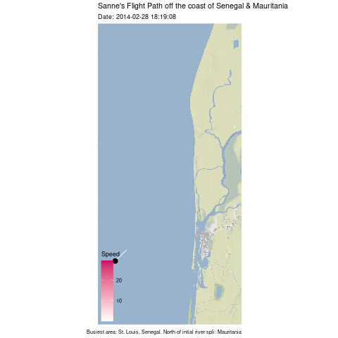
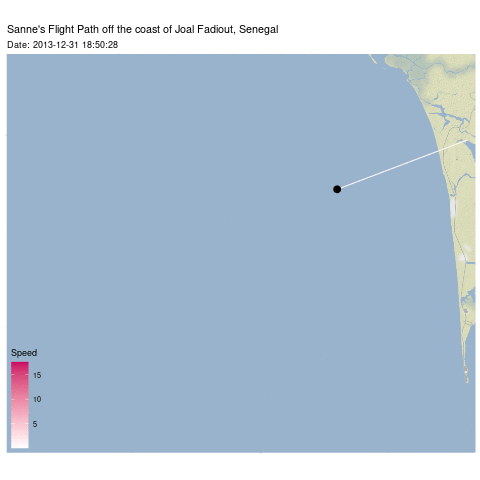

<center></center>


```{r setup, include=FALSE, echo = FALSE}
knitr::opts_chunk$set(echo = TRUE, error=TRUE, message=FALSE, warning=FALSE)
```

```{r libraries, echo = FALSE}
library(tidyverse)     # for data cleaning and plotting
library(gardenR)       # for Lisa's garden data
library(lubridate)     # for date manipulation
library(openintro)     # for the abbr2state() function
library(palmerpenguins)# for Palmer penguin data
library(maps)          # for map data
library(ggmap)         # for mapping points on maps
library(gplots)        # for col2hex() function
library(RColorBrewer)  # for color palettes
library(sf)            # for working with spatial data
library(leaflet)       # for highly customizable mapping
library(ggthemes)      # for more themes (including theme_map())
library(plotly)        # for the ggplotly() - basic interactivity
library(gganimate)     # for adding animation layers to ggplots
library(transformr)    # for "tweening" (gganimate)
library(babynames)    # baby names
#library(gifski)        # need the library for creating gifs but don't need to load each time
library(shiny)         # for creating interactive apps
theme_set(theme_minimal())
```

```{r data, echo = FALSE}
# Bird Migration Data
bird_migration <- read_csv("bird_migration.csv")
```

## Introduction


Ever wondered what a seagull does every day? Every month? In this data visualization you'll finally learn.  [is that too cheesy?]   Most species of seagulls are migratory birds. They change locations based on temperature, breeding season, and food scarcity. Two organizations, LifeWatch and Flanders Marine Institute, worked together to collect data on the flight's of three Lesser Black-backed Gulls. They attached lightweight, solar powered GPS devices to the bird's ankles that record several data points. For more information, visit their site by clicking [here ](https://oscibio.inbo.be/blog/bird-tracking-data-published/).

The data spans from August 2013 to April 2014 and covers many countries along the outer coast of Eastern Europe and the NorthEast of Africa. The depth of information about their flight data allows us to ask some key questions. Did these seagull's travel together when migrating or do their flight patterns differ? As for the flight itself, what is a common speed and altitude for traveling seagull's? 

These gulls are primarily omnivorous. Their diet includes a wide variety of fish, insects, mollusks, crustaceans, marine worms, small birds, nestlings, eggs, rodents; also eats berries, seeds, seaweed. Sea gulls also scavenge refuse around garbage dumps.


## Eric, Nico, and Sanne's 2013 


**A Late Summer in France**
```{r, eval = FALSE, echo = FALSE}
FRANCE <- get_stamenmap(
    bbox = c(left = -.622, bottom = 48.6, right = 6.3, top = 50.6),
    maptype = "terrain",
    zoom = 7)

bird_migration <- read_csv("bird_migration.csv") %>% 
  select(-X1) 

FRANCEpathdates <- bird_migration %>% 
  mutate(date2 = date_time) %>% 
  tidyr::separate(date_time, c("date", "time"), sep = " ") %>% 
  filter(date <  "2013-9-30") %>% 
  select(-device_info_serial) %>% 
  mutate(min_lat = min(latitude)) %>%      #min = 14
  mutate(max_lat = max(latitude)) %>%      #max = 51
  mutate(min_long = min(longitude)) %>%    #min = -17
  mutate(max_long = max(longitude))        #max = 5

FRANCE_anim <- ggmap(FRANCE)+
    geom_path(data = FRANCEpathdates,
              aes(x = longitude,
                 y = latitude,
                 color = bird_name
                 ))+
  scale_color_manual(values = c("Nico" = "#660066",
                             "Sanne" = "#CC0066",
                             "Eric" = "3399FF"))+
  geom_point(data = FRANCEpathdates,
              aes(x = longitude,
                 y = latitude,
                 color = bird_name
                 ))+
  scale_color_manual(values = c("Nico" = "#660066",
                             "Sanne" = "#CC0066",
                             "Eric" = "3399FF"))+
  
    labs(title = "Sanne Took Off Much Earlier Than the Other Two",
         subtitle = "Time: {frame_along}",
         x = "Longitude",
       y = "Latitude")+
  
  transition_reveal(date2)+
  theme_map()

animate(FRANCE_anim, nframes = 200)
```

```{r, eval = FALSE, echo = FALSE}
anim_save("FRANCE_gif.gif") 
```

```{r, echo = FALSE}
knitr::include_graphics("FRANCE_gif.gif")
```
The gulls' data set begins with their summer in Northern France. As you can observe from the animation, the gull Sanne (pink) took off for the coast in early September, two months later Nico and Eric took off as well.  

**Eric, Nico and Sanne's 2013 Flight Paths**
Here is a map of the year-long flight paths of the three birds.

```{r, eval = FALSE, echo = FALSE}
WHOLEFLIGHT <- get_stamenmap(
    bbox = c(left = -17, bottom = 14, right = 5, top = 51),
    maptype = "terrain",
    zoom = 5)

bird_migration <- read_csv("bird_migration.csv") %>% 
  select(-X1) 

WHOLEFLIGHTpathdates <- bird_migration %>% 
  mutate(date2 = date_time) %>% 
  tidyr::separate(date_time, c("date", "time"), sep = " ") %>% 
  filter(date <  "2013-12-30") %>% 
  select(-device_info_serial) %>% 
  mutate(min_lat = min(latitude)) %>%      #min = 14
  mutate(max_lat = max(latitude)) %>%      #max = 51
  mutate(min_long = min(longitude)) %>%    #min = -17
  mutate(max_long = max(longitude))        #max = 5

WHOLEFLIGHT_anim <- ggmap(WHOLEFLIGHT)+
    geom_path(data = WHOLEFLIGHTpathdates,
              aes(x = longitude,
                 y = latitude,
                 color = bird_name
                 ))+
  scale_color_manual(values = c("Nico" = "#660066",
                             "Sanne" = "#CC0066",
                             "Eric" = "3399FF"))+
  geom_point(data = WHOLEFLIGHTpathdates,
              aes(x = longitude,
                 y = latitude,
                 color = bird_name
                 ))+
  scale_color_manual(values = c("Nico" = "#660066",
                             "Sanne" = "#CC0066",
                             "Eric" = "3399FF"))+
  
    labs(x = "Longitude",
       y = "Latitude",title = "The Three Birds Traveled Thousands of Miles in 2013",
         subtitle = "Time: {frame_along}")+
  
  transition_reveal(date2)+
  theme_map()
  

animate(WHOLEFLIGHT_anim, nframes = 200)
```

```{r, eval = FALSE, echo = FALSE}
anim_save("WHOLEFLIGHT_gif.gif") 
```

```{r, echo = FALSE}
knitr::include_graphics("WHOLEFLIGHT_gif.gif")
```
<p style="font-family: Helvetica, Sans-serif;color:#993399">sample</p>

## Flight Altitude


In this data set, the altitude is measured in feet. In order to observe altitude trends, we will be comparing Eric's altitudes during the first week of January and the first week of March. It is important to observe only one bird so that we have a constant.
  
### Eric's January Data
```{r, eval = FALSE, echo = FALSE}

Morroco <- get_stamenmap(
    bbox = c(left = -9.8, bottom = 30.1, right = -9.5, top = 30.5),
    maptype = "terrain",
    zoom = 10)


bird_migration <- read_csv("bird_migration.csv") %>% 
  select(-X1) 

  
Eric_Alt_Jan <- bird_migration %>% 
  mutate(date2 = date_time) %>% 
  tidyr::separate(date_time, c("date", "time"), sep = " ") %>% 
  filter(date == c("2014-01-01", "2014-01-02", "2014-01-03", "2014-01-04", "2014-01-05", "2014-01-06", "2014-01-07")) %>% 
  filter(altitude < 4000) %>% 
  filter(bird_name == "Eric") %>% 
  select(-device_info_serial) %>% 
  mutate(min_lat = min(latitude)) %>%      #min = 30.1
  mutate(max_lat = max(latitude)) %>%      #max = 30.5
  mutate(min_long = min(longitude)) %>%    #min = -9.9
  mutate(max_long = max(longitude))        #max = -9.5
  
EricAltJan_gganim <- ggmap(Morroco)+
    geom_path(data = Eric_Alt_Jan,
              aes(x = longitude,
                 y = latitude,
                 color = altitude))+
  scale_color_gradient(high = '#FF6600', low = '#660066')+
  geom_point(data = Eric_Alt_Jan,
             aes(x = longitude,
                 y = latitude),
                 color = "#000000",
                 size = 3)+
  
    labs(x = "Longitude",
       y = "Latitude",
      title = "Eric's Flight Altitude January",
         subtitle = "Time: {frame_along}")+
  
  transition_reveal(date2)+
  theme_map()
animate(EricAltJan_gganim, nframes = 200)
```

```{r, eval = FALSE, echo = FALSE}
anim_save("EricAltJan.gif") 
```


```{r, echo = FALSE}
knitr::include_graphics("EricAltJan.gif")
```

Eric's altitude during the first week of January was between -246 ft and 92 ft. His flight pattern shows that he flies at a low altitude when he heads towards a destination at sea. He then returns to land at a higher flight altitude. This makes sense because sea levels are lower than land and there are less obstacles to fly over. His altitude patterns may be a tool to conserve energy.

### Eric's March Data

```{r, eval = FALSE, echo = FALSE}
Eric_Alt_March <- bird_migration %>% 
  mutate(date2 = date_time) %>% 
  tidyr::separate(date_time, c("date", "time"), sep = " ") %>% 
  filter(date == c("2014-03-01", "2014-03-02", "2014-03-03", "2014-03-04", "2014-03-05", "2014-03-06", "2014-03-07")) %>% 
  filter(bird_name == "Eric") %>% 
  select(-device_info_serial) %>% 
  mutate(min_lat = min(latitude)) %>%     
  mutate(max_lat = max(latitude)) %>%      
  mutate(min_long = min(longitude)) %>%    
  mutate(max_long = max(longitude))
EricAltMarch_gganim <- ggmap(Morroco)+
    geom_path(data = Eric_Alt_March,
              aes(x = longitude,
                 y = latitude,
                 color = altitude))+
  scale_color_gradient(high = '#FF6600', low = '#660066')+
  geom_point(data = Eric_Alt_March,
             aes(x = longitude,
                 y = latitude),
                 color = "#000000",
                 size = 3)+
  
    labs(title = "Eric's Flight Altitude March",
         x = "Longitude",
          y = "Latitude",
         subtitle = "Time: {frame_along}")+
  
  transition_reveal(date2)+
  theme_map()
animate(EricAltMarch_gganim, nframes = 200)
```

```{r, eval = FALSE, echo = FALSE}
anim_save("EricAltMarch.gif")
```

```{r, echo = FALSE}
knitr::include_graphics("EricAltMarch.gif")
```

Eric's altitude in the first week of March was between -438 ft and 317 ft. This is a much broader range than his altitude in the first week of January. It makes sense that gulls fly at higher altitudes in warmer months since the prevailing winds are picking up in force. Bird's use the strength of prevailing winds to save energy as the months get warmer. Compared to January, Eric is not traveling out to sea as much and when he does, it is not as far of a distance. This could indicate that perhaps Eric is traveling for a food source that becomes easier to catch in warmer weather, such as fish. 

## Flight Speed


```{r, eval = FALSE, echo = FALSE}

bird_migration1 <- bird_migration %>% 
  mutate(date2 = date_time) %>% 
  select(-device_info_serial) %>% 
  separate(date_time, c("date", "time"), sep = " ") %>% 
  mutate(date_tag = date) %>% 
  separate(date_tag,
           c("Year", "Month", "Day")) %>%
  mutate(Day = as.numeric(Day)) %>% 
  filter(bird_name == "Sanne", Month == "01", Day <= 7) %>% 
  rename(Speed = speed_2d) %>% 
  mutate(min_lat = min(latitude), #13.88409
         max_lat = max(latitude), #14.14706	
         min_long = min(longitude), #-17.0744	
         max_long = max(longitude)) #-16.75575
 
Sanne <- get_stamenmap(
    bbox = c(left = -17.0744, bottom = 13.88409, right = -16.75575, top = 14.14706), 
    maptype = "terrain",
    zoom = 12)

Sanne_Path_Anim <- ggmap(Sanne) + 
  geom_path(data = bird_migration1,
            aes(x = longitude,
                y = latitude,
                color = Speed)) +
  geom_point(data = bird_migration1, 
             aes(x = longitude,
                 y = latitude),
             size = 3) +
  labs(x = "Longitude",
       y = "Latitude",
       title = "Sanne's Flight Path off the coast of Joal Fadiout, Senegal",
       subtitle = "Date: {frame_along}") +
  scale_color_gradient(high = '#000000',
                       low = '#FFFFFF') +
  transition_reveal(along = date2)+
  theme_map()

animate(Sanne_Path_Anim, fps = 5)

```

This data visualization shows Sanne’s flight path off the coast of Senegal during the first week of January. This area of Senegal is a dry, tropical, and sparsely populated - the perfect destination for Sanne to escape the cold and busy towns of Northern France where she otherwise stays.
 
Each day Sanne starts in what appears to be a protected natural area in the town of Fadiouth. She then takes flight over the Atlantic ocean, only to make a loop and return to an area by the coastal town of Palmarin. This happens each day, with trips occasionally being taken directly between Fadiouth and Palmarin. We can presume that she is going for her daily fish hunt. Since seagulls are omnivores and can also eat things that are found on land, on the days she does not fly out to sea she has probably located enough food on land. She might be bringing food back to a nest, but this does not align with her starting and ending destination being different. 

There is only a slightly noticeable pattern in Sanne’s flight speed. While near land, she flies slowly, rarely exceeding 5 kilometers per hour. She flies the fastest when flying further into the ocean and on her return. Here she reaches speeds of 15 kph, with an average speed of 10 kph. Once far enough, she slows down to a speed of 0 to 5 kph again in order to look for prey more easily. Sometimes she’ll circle the area, but once she’s satisfied, she’ll return. Her average flight speed is 2.450434 kpm.


```{r}
bird_migration_march <- bird_migration %>% 
  mutate(date2 = date_time) %>% 
  select(-device_info_serial) %>% 
  separate(date_time, c("date", "time"), sep = " ") %>% 
  mutate(date_tag = date) %>% 
  separate(date_tag,
           c("Year", "Month", "Day")) %>%
  mutate(Day = as.numeric(Day)) %>% 
  filter(bird_name == "Sanne", Month == "03", Day <= 7) %>% 
  rename(Speed = speed_2d) %>% 
    mutate(min_lat = min(latitude), #15.85621
         max_lat = max(latitude), #16.4196	
         min_long = min(longitude), #-16.69871	
         max_long = max(longitude)) #-16.41869

SanneMarch <- get_stamenmap(
    bbox = c(left = -16.69871, bottom = 15.85621, right = -16.41869, top = 16.4196), 
    maptype = "terrain",
    zoom = 12)

Sanne_Path_Anim_March <- ggmap(SanneMarch) + 
  geom_path(data = bird_migration_march,
            aes(x = longitude,
                y = latitude,
                color = Speed)) +
  geom_point(data = bird_migration_march, 
             aes(x = longitude,
                 y = latitude),
             size = 3) +
  labs(x = "",
       y = "",
       title = "Sanne's Flight Path off the coast of Senegal & Mauritania",
       subtitle = "Date: {frame_along}",
       caption = "Busiest area: St. Louis, Senegal. North of intial river spli: Mauritania") +
  scale_color_gradient(high = '#CC0066',
                       low = '#FFFFFF') +
  theme_map() +
  theme(legend.background = element_blank()) +
  transition_reveal(along = date2)

animate(Sanne_Path_Anim_March, fps = 5)

anim_save("SanneFlightMarch.gif")



```

The data visualization for March is less insightful. Sanne flies in a similar pattern to January. She starts from the city of St Louis and flies down a peninsula only to circle back and return to the city. There seems to be plenty of food in St Louis and the surrounding bay. The exception is a long trip up a river into Mauritania and back down the coast, and a journey into the ocean that ends abruptly. Sanne rarely picks up her speed except for when she takes detours from her normal path which require her to travel longer distances. While traveling in the urban area, she does not appear to go above 10 kpm.

```{r, eval = FALSE, echo = FALSE}
anim_save("SanneFlightJan.gif")
```

```{r, echo = FALSE}

```


## Conclusion

**Why should *you* care about Nico, Eric, and Sanne?**

According to Planet Experts author, Daniela Ginta, seagulls are the ["Unlikely Canaries of Climate Change](http://www.planetexperts.com/seagulls-unlikely-canaries-climate-change/). Seagull populations are declining as human populations rise. As climate change warms Earth's seas, the ocean goes through acidification, and humans continue to overfish, the gulls are faced with reduction in their sea sourced food. This is causing sea gulls to find more food from human garbage. Seagulls are not currently threatened by extinction, however, if such a hardy and world-wide species is threatened by climate change -- we as humans have a duty to change ways. This begins with reducing fossil fuel use. 

