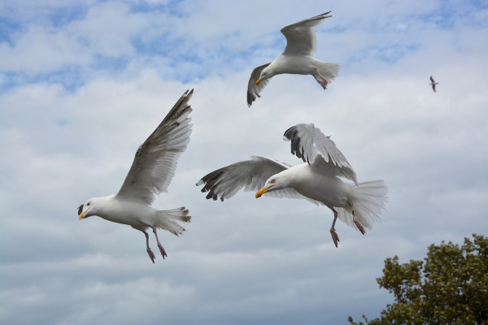

```{r setup, include=FALSE, echo = FALSE}
knitr::opts_chunk$set(echo = TRUE, error=TRUE, message=FALSE, warning=FALSE)
```

```{r libraries, echo = FALSE}
library(tidyverse)     # for data cleaning and plotting
library(gardenR)       # for Lisa's garden data
library(lubridate)     # for date manipulation
library(openintro)     # for the abbr2state() function
library(palmerpenguins)# for Palmer penguin data
library(maps)          # for map data
library(ggmap)         # for mapping points on maps
library(gplots)        # for col2hex() function
library(RColorBrewer)  # for color palettes
library(sf)            # for working with spatial data
library(leaflet)       # for highly customizable mapping
library(ggthemes)      # for more themes (including theme_map())
library(plotly)        # for the ggplotly() - basic interactivity
library(gganimate)     # for adding animation layers to ggplots
library(transformr)    # for "tweening" (gganimate)
library(babynames)    # baby names
#library(gifski)        # need the library for creating gifs but don't need to load each time
library(shiny)         # for creating interactive apps
theme_set(theme_minimal())
```

```{r data, echo = FALSE}
# Bird Migration Data
bird_migration <- read_csv("bird_migration.csv")
```

## Introduction

Most species of seagulls are migratory birds. They change locations based on temperature, breeding seasons, and food scarcity. Two organizations, LifeWatch and Flanders Marine Institute, worked together to collect data on the flight's of gulls. They attached lighweight, solar powered GPS devices to the bird's ankles that record several data points. For more information, visit their site by clicking [here ](https://oscibio.inbo.be/blog/bird-tracking-data-published/). 
The data spans from August 2013 to April 2014 and covers many countries. This broad range of information allows us to ask some key questions. Do seagull's travel together when migrating or do their flight patterns differ? As for the flight itself, what is a common speed and altitude for traveling seagull's? 

## Flight Paths

## Flight Altitude

  In this dataset, the altitude is measured in feet. In order to observe altitude trends, we will be comparing Eric's altitudes during the first week of January and the first week of March. It is important to observe only one bird so that we have a constant. 
  
### Eric's January Data
```{r, eval = FALSE, echo = FALSE}

Morroco <- get_stamenmap(
    bbox = c(left = -9.8, bottom = 30.1, right = -9.5, top = 30.5),
    maptype = "terrain",
    zoom = 10)


bird_migration <- read_csv("bird_migration.csv") %>% 
  select(-X1) 

  
Eric_Alt_Jan <- bird_migration %>% 
  mutate(date2 = date_time) %>% 
  tidyr::separate(date_time, c("date", "time"), sep = " ") %>% 
  filter(date == c("2014-01-01", "2014-01-02", "2014-01-03", "2014-01-04", "2014-01-05", "2014-01-06", "2014-01-07")) %>% 
  filter(altitude < 4000) %>% 
  filter(bird_name == "Eric") %>% 
  select(-device_info_serial) %>% 
  mutate(min_lat = min(latitude)) %>%      #min = 30.1
  mutate(max_lat = max(latitude)) %>%      #max = 30.5
  mutate(min_long = min(longitude)) %>%    #min = -9.9
  mutate(max_long = max(longitude))        #max = -9.5
  
EricAltJan_gganim <- ggmap(Morroco)+
    geom_path(data = Eric_Alt_Jan,
              aes(x = longitude,
                 y = latitude,
                 color = altitude))+
  scale_color_gradient(high = '#660066', low = '#FF0000')+
  geom_point(data = Eric_Alt_Jan,
             aes(x = longitude,
                 y = latitude),
                 color = "#000000",
                 size = 3)+
  
    labs(title = "Eric's Flight Altitude January",
         subtitle = "Time: {frame_along}")+
  
  transition_reveal(date2)
animate(EricAltJan_gganim, nframes = 200)
```

```{r, eval = FALSE, echo = FALSE}
anim_save("EricAltJan.gif")
```


```{r, echo = FALSE}
knitr::include_graphics("EricAltJan.gif")
```

Eric's altitude during the first week of January was between -246 ft and 92 ft. His flight pattern shows that he flies at a low altitude when he heads towards a destination at sea. He then returns to land at a higher flight altitude. This makes sense because sea levels are lower than land and there are less obstacles to fly over. His altitude patterns may be a tool to conserve energy.

### Eric's March Data

```{r, eval = FALSE, echo = FALSE}
Eric_Alt_March <- bird_migration %>% 
  mutate(date2 = date_time) %>% 
  tidyr::separate(date_time, c("date", "time"), sep = " ") %>% 
  filter(date == c("2014-03-01", "2014-03-02", "2014-03-03", "2014-03-04", "2014-03-05", "2014-03-06", "2014-03-07")) %>% 
  filter(bird_name == "Eric") %>% 
  select(-device_info_serial) %>% 
  mutate(min_lat = min(latitude)) %>%     
  mutate(max_lat = max(latitude)) %>%      
  mutate(min_long = min(longitude)) %>%    
  mutate(max_long = max(longitude))
EricAltMarch_gganim <- ggmap(Morroco)+
    geom_path(data = Eric_Alt_March,
              aes(x = longitude,
                 y = latitude,
                 color = altitude))+
  scale_color_gradient(high = '#660066', low = '#FF0000')+
  geom_point(data = Eric_Alt_March,
             aes(x = longitude,
                 y = latitude),
                 color = "#000000",
                 size = 3)+
  
    labs(title = "Eric's Flight Altitude March",
         subtitle = "Time: {frame_along}")+
  
  transition_reveal(date2)
animate(EricAltMarch_gganim, nframes = 200)
```

```{r, eval = FALSE, echo = FALSE}
anim_save("EricAltMarch.gif")
```

```{r, echo = FALSE}
knitr::include_graphics("EricAltMarch.gif")
```

Eric's altitude in the first week of March was between -438 ft and 317 ft. This is a much broader range than his altitude in the first week of January. It makes sense that gulls fly at higher altitudes in warmer months since the prevailing winds are picking up in force. Bird's use the strength of prevailing winds to save energy as the months get warmer. Compared to January, Eric is not traveling out to sea as much and when he does, it is not as far of a distance. This could indicate that perhaps Eric is traveling for a food source that becomes easier to catch in warmer weather, such as fish. 

## Flight Speed
